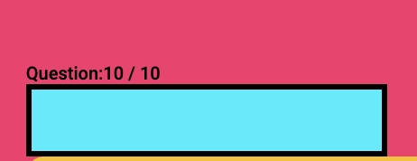
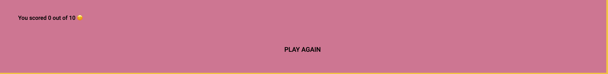

<a href ="https://samiksha-92.github.io/quiz-js/" target = "_blank"> View the live project here </a>

# The World Mini Quiz 

This quiz is a simple and fun way to test your knowledge about the geography of the world.
The questions are simple and the player can see the results in the end and play again if he/she is not happy with the score.

This quiz was made entirely by using Javascript, HTML and CSS.

 

 ## **Features**

### **Existing features:**

- **The Quiz Heading Area:**

1. This area displays the title of the project to the user. The user knows clearly about the objective of the game through the title.
2. The background colour is bright pink and the text colour is black for contrast.

- **Progressbar Area:**

1. This area features a progress bar which shows the user which question is he/she on.
2. The colour chosen for this progress is a bright blue color, keeping in line with the bright colours.

- **Questions Area:**

1. This area features the questions to be displayed on screen.
2. Secondly, this area has the options associated with a particular question.
3. Also, this area also has a submit button, the user can click on this button after choosing an option.
After that the user is taken to the next question.

- **Score Area:**

1. This area features the final score of the user.
2. If the answer is correct, the score increments and else, it stays the same.
3. This area also has a play again button. A user can choose to play the quiz again by clicking on this button.

- **User Stories:**

1. As a first time user I would like to see the title of the application(quiz) so that I know what exactly will I be doing with it.
2. As a first time user, I would clearly like to see which question am I on and how many questions are remaining.
3. As a first time user, I would like to see the options to the questions clearly.
4. As a first time user, I would like to have a submit button to submit my answer.
5. As a first time user, I would like to see my total score.
6. As a first time user, I would like to have an option to restart the game if I feel to do so, at the end of each round.
(Please Note: Each round has 10 questions)

- **Testing:**

The W3C Markup Validator, W3C CSS Validator Services and JShint were used to validate the code on this application.
 
 1. <a href = "https://validator.w3.org/nu/?doc=https%3A%2F%2Fsamiksha-92.github.io%2Fquiz-js%2F" target ="_blank"> There were was error found in the beginning, the main div had a missing closing element. This was resolved upon final testing there were no errors or warnings.</a>
 2. <a href = "https://jigsaw.w3.org/css-validator/validator?uri=https%3A%2F%2Fsamiksha-92.github.io%2Fquiz-js%2F&profile=css3svg&usermedium=all&warning=1&vextwarning=&lang=en" target ="_blank"> These were the results of the W3C CSS Validator. All significant errors were resolved. </a>
 3. <a href = "https://jshint.com/" target = "_blank"> No errors were found upon final testing.</a>
 4. All user stories were thoroughly tested and validated against their expected outcomes. No errors were found.
 5. No media queries were used in CSS styling. However, the application tested well across all major media devices such as:
 - ipad Air
 - ipad Mini
 - iPhone 12 Pro
 - Pixel 5
 - MacBook Pro

 ## **Deployment**

The website was deployed using Github pages using the following steps:

1. Log in to GitHub and locate the GitHub Repository.
2. At the top of the Repository (not top of page), locate the "Settings" Button on the menu.
3. Scroll down the Settings page until you locate the "GitHub Pages" Section.
4. Under "Source", click the dropdown called "None" and select "Master Branch".
5. The page will automatically refresh.</li>
6. Scroll back down through the page to locate the now published site link in the "GitHub Pages" section.

 
## **Forking the Github Repository**

By forking the GitHub Repository we make a copy of the original repository on our GitHub account to view and/or make changes without affecting the original repository by using the following steps below:

1. Log in to GitHub and locate the GitHub Repositor.
2. At the top of the Repository (not top of page) just above the "Settings" Button on the menu, locate the "Fork" Button.
3. You should now have a copy of the original repository in your GitHub account.

 

## **Making a Local Clone**

1. Log in to GitHub and locate the <a href="https://github.com/samiksha-92/rps-game" target="_blank">Github Repository</a>
2. Under the repository name, click "Clone or download".
3. To clone the repository using HTTPS, under "Clone with HTTPS", and copy the link.
4. Open Git Bash
5. Change the current working directory to the location where you want the cloned directory to be made.
6. Type <code>git clone </code>, and then paste the url copied in step 3. 
<code>$ git clone https://github.com/YOUR-USERNAME/YOUR-REPOSITORY</code>

Press Enter. Your local clone will be created. 
<code> $ git clone https://github.com/YOUR-USERNAME/YOUR-REPOSITORY
> Cloning into `CI-Clone`...
> remote: Counting objects: 10, done.  
> remote: Compressing objects: 100% (8/8), done.
> remove: Total 10 (delta 1), reused 10 (delta 1)
> Unpacking objects: 100% (10/10), done.
</code>
 
<a href="https://docs.github.com/en/repositories/creating-and-managing-repositories/cloning-a-repository#cloning-a-repository-to-github-desktop" target="_blank"> Click here</a> to see detailed instructions with images.

## **Code**
- The understanding of reload function code was made possible using <a href = "https://www.w3schools.com/jsref/met_loc_reload.asp" target ="_blank">W3Schools.
- A lot of understanding of Javascript concepts on this project was made possible thanks to <a href = "https://www.youtube.com/c/CodeWithHarry" target ="_blank"> this Youtube channel </a>

## **Content**

- The content(questions) on this application was provided by <a href = "https://www.edudwar.com/world-gk-quiz-questions-and-answers/" target = "_blank"> this website. </a>

### **Acknowledgements**

-  My mentor Jack Wachira for continuous feedback and suggestions for improvements on my projectwork. 
- My husband Dushyant Sabharwal for his support and feedback on my projectwork.

 

